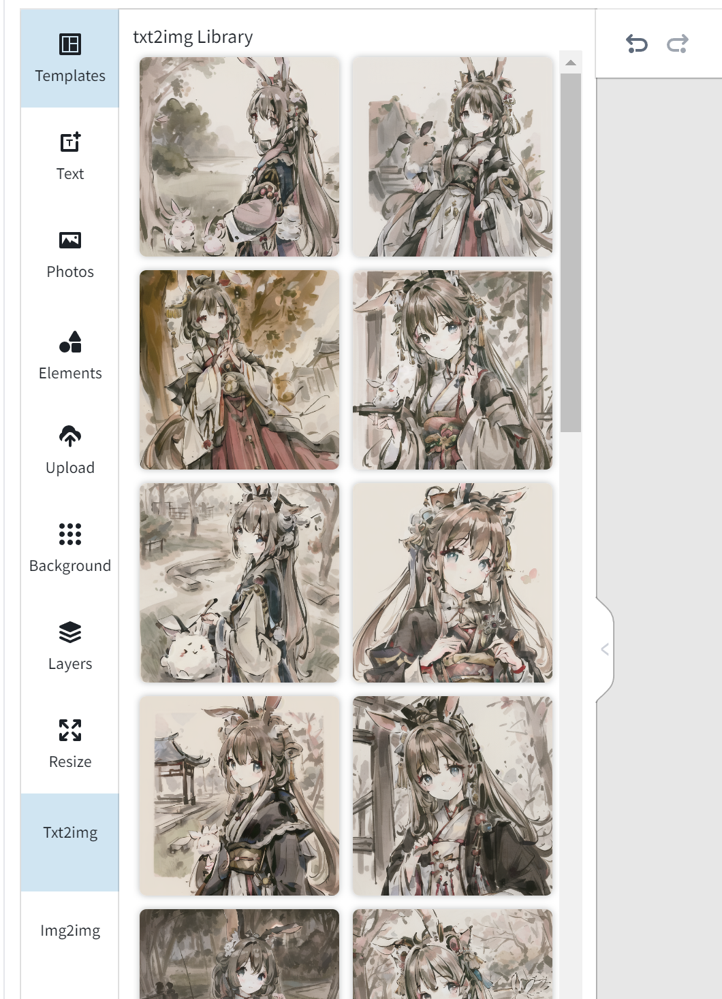

# Stable Diffusion WebUI Canvas Editor
A custom extension for [AUTOMATIC1111/stable-diffusion-webui](https://github.com/AUTOMATIC1111/stable-diffusion-webui) that integrated a full capability canvas editor which you can use layer, text, image, elements and so on, then send image to or receive image from img2img/inpaint or send image to ContronNet, basing on [Polotno](https://polotno.com/).  

## Installation
Just like you install other extension of webui:
1. go to Extensions -> Install from URL
2. paste this repo link
3. install
4. go to Installed, apply and restart UI

or you can just find it from Extensions-> Available, and load the offical index URL, this extension is already included in it:

## Key Feature
1. Full capability image editor, such as Effects, Crop, Position, Lock, etc
2. Templates
3. Text
4. Photos
5. Elements
6. Upload
7. Background
8. Layers
9. load your local sd generated images as library directly
10. send image to or receive image from img2img/inpaint
11. send image to ContronNet

## Further Plan
1. rebuild Polotno (Done)
2. Send image to img2img, Sketch, Inpaint, etc (Done)
3. Pen and eraser support
4. connect to Segment Anything to segment image
5. any suggestions or requirements are welcome

## Polotno API Key
I included my Polotno api key, notice it only supports local environment (localhost or 127.0.0.1) for non-commercial purpose.
It is easy to create your own free api key from [Polotno API](https://polotno.com/cabinet), then you can replace mine from webui Settings -> Canvas Editor

## Credits
Created by [jtydhr88](https://github.com/jtydhr88) basing on [Polotno](https://polotno.com/).

## My other extension for stable diffusion webui
- [3D Model/pose loader](https://github.com/jtydhr88/sd-3dmodel-loader) A custom extension for AUTOMATIC1111/stable-diffusion-webui that allows you to load your local 3D model/animation inside webui, or edit pose as well, then send screenshot to txt2img or img2img as your ControlNet's reference image.
- [StableStudio Adapter](https://github.com/jtydhr88/sd-webui-StableStudio) A custom extension for AUTOMATIC1111/stable-diffusion-webui to extend rest APIs to do some local operations, using in StableStudio.
- [Txt/Img to 3D Model](https://github.com/jtydhr88/sd-webui-txt-img-to-3d-model) A custom extension for sd-webui that allow you to generate 3D model from txt or image, basing on OpenAI Shap-E.