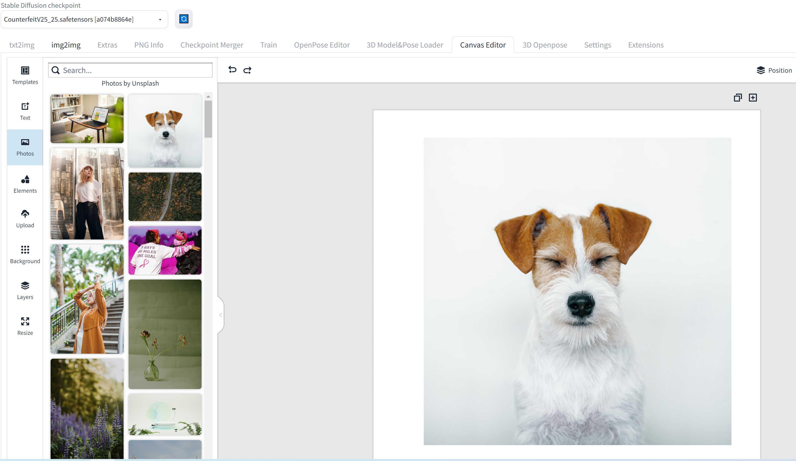
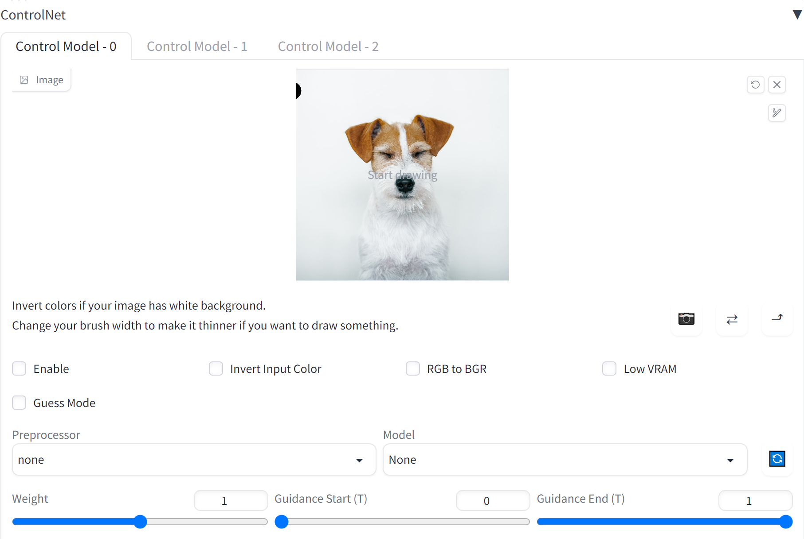
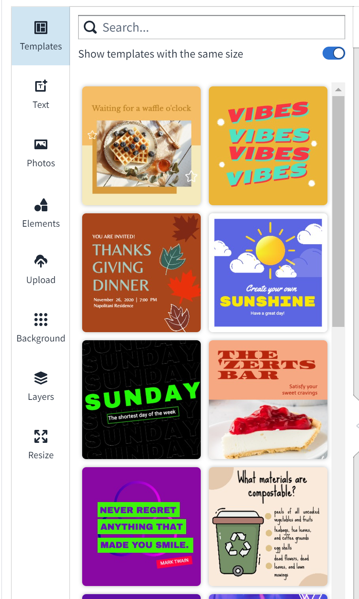
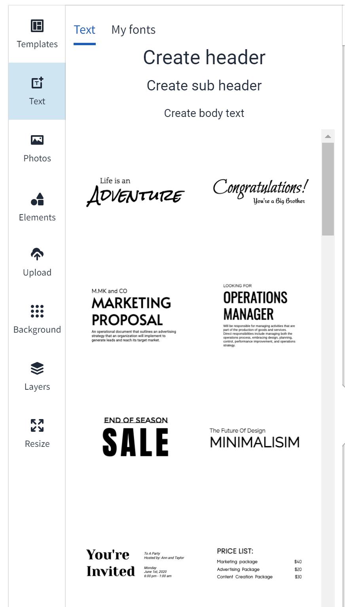
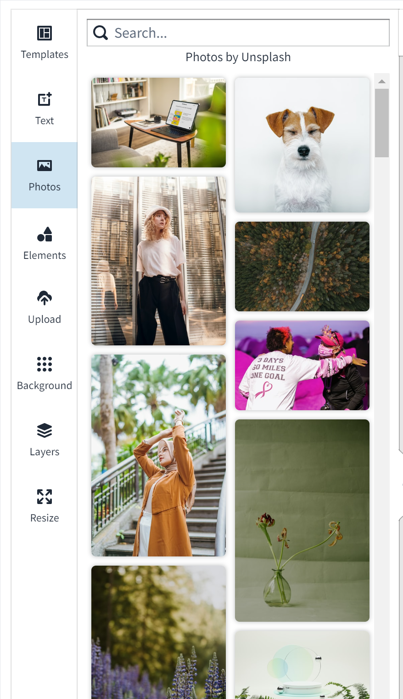
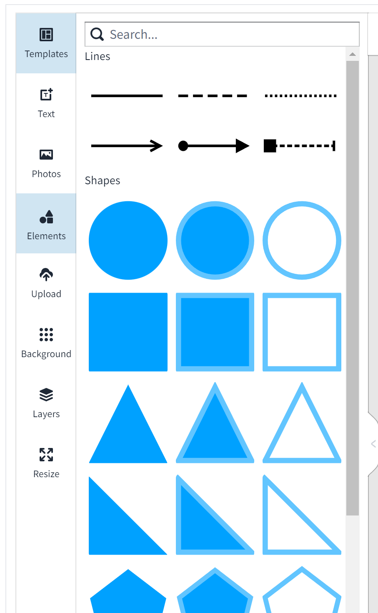
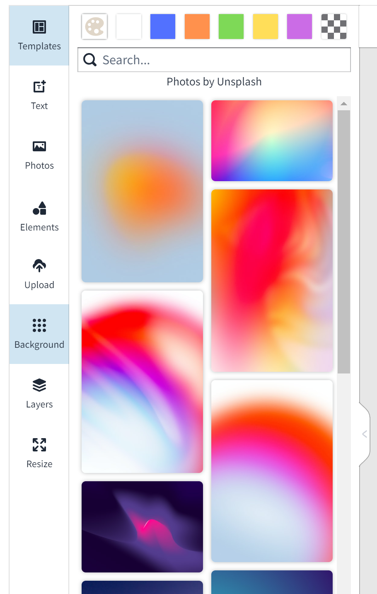
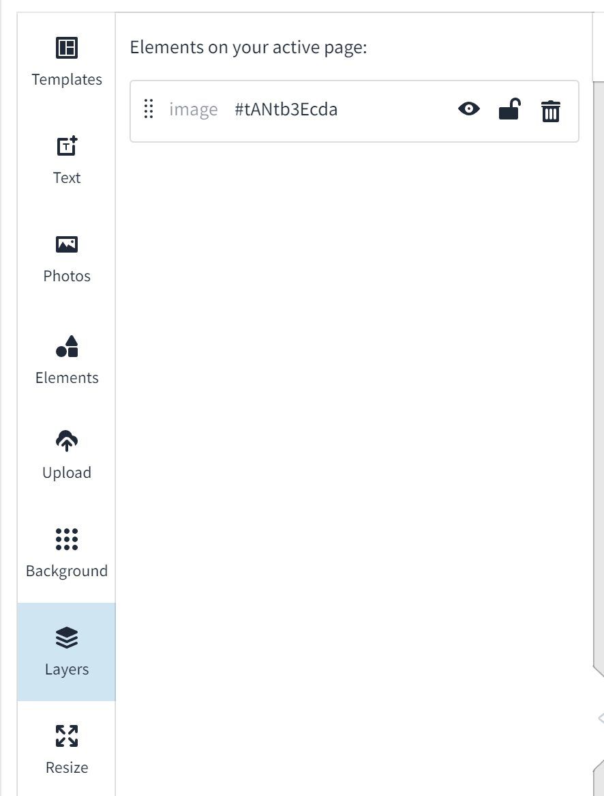

# Stable Diffusion WebUI Canvas Editor
A custom extension for [AUTOMATIC1111/stable-diffusion-webui](https://github.com/AUTOMATIC1111/stable-diffusion-webui) that integrated a full capability canvas editor which you can use layer, text, image, elements and so on, then send to ControlNet, basing on [Polotno](https://polotno.com/).  

## Installation
Just like you install other extension of webui:
1. go to Extensions -> Install from URL
2. paste this repo link
3. install
4. go to Installed, apply and restart UI

## Key Feature
1. Full capability image editor, such as Effects, Crop, Position, Lock, etc
2. Templates
3. Text
4. Photos
5. Elements
6. Upload
7. Background
8. Layers

## Further Plan
1. rebuild Polotno
2. Send image to img2img, Sketch, Inpaint, etc
3. Pen and eraser support
4. connect to Segment Anything to segment image
5. any suggestions or requirements are welcome

## Polotno API Key
I included my Polotno api key, notice it only supports local environment (localhost or 127.0.0.1) for non-commercial purpose.
It is easy to create your own free api key from [Polotno API](https://polotno.com/cabinet), then you can replace mine from webui Settings -> Canvas Editor

## Credits
Created by [jtydhr88](https://github.com/jtydhr88) basing on [Polotno](https://polotno.com/).
